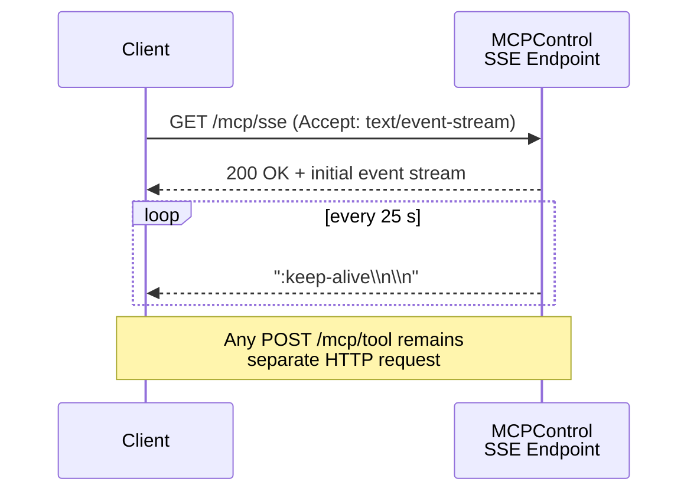
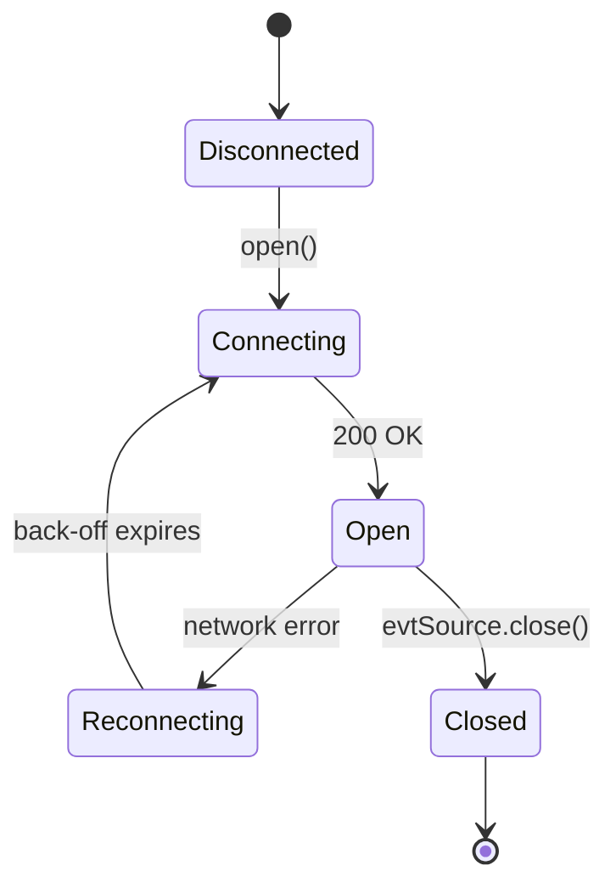

## Executive overview

Server-Sent Events (SSE) let the server stream a unidirectional, text-based event feed over plain HTTP. Compared with raw “streaming-HTTP” hacks or a full WebSocket upgrade, SSE provides automatic reconnection, built-in last-event IDs, and works through most corporate proxies—all while piggy-backing on the existing MCP REST port.➀ The upgrade path below adds a lightweight `SseTransport` alongside your existing HTTP and (paused) WebSocket modules, keeping the public MCP API unchanged for callers that still prefer request/response semantics. This document walks through the spec, code additions, and testing so an offline agent can implement the feature end-to-end.

---

## 1  Why SSE for MCPControl?

* **Standards-based.** Defined in the HTML Standard as the `text/event-stream` MIME type and the `EventSource` API, so every browser—and many Node polyfills—“just work”.➁ ➂  
* **Cheaper than WebSockets.** No HTTP upgrade handshake (+1 RTT) and no full-duplex buffering; the server can flush whenever data is ready.➆ ➉  
* **Auto-reconnect & backfill.** Clients resend `Last-Event-ID`; server can replay missed messages.➃  
* **Fits MCP’s mostly-server-to-client traffic.** Tool-invocation responses, progress updates, and logs stream *out*; inbound commands remain normal POSTs.

---

## 2  High-level upgrade checklist

| Step | Owner | Key files |
|------|-------|-----------|
| 1. Add `SSE` to `TransportType` enum | `src/types/transport.ts` | |
| 2. Create `src/transports/sseTransport.ts` | new | |
| 3. Register route in `src/server.ts` (`/mcp/sse`) | server | |
| 4. Emit heartbeat & ID tracking | transport | |
| 5. Client polyfill docs (`eventsource` npm) | docs | |
| 6. Unit tests with Vitest | `test/sse.spec.ts` | |
| 7. Update README badges / docs | docs | |

(A diff view appears in §5.)

---

## 3  Protocol specification (SSE flavour)

### 3.1 Endpoint

```
GET /mcp/sse?auth=<jwt>&v=2025-04-30 HTTP/1.1
Accept: text/event-stream
```

Headers returned:

```
HTTP/1.1 200 OK
Content-Type: text/event-stream; charset=utf-8
Cache-Control: no-cache
Connection: keep-alive
```

> **Auth** – Re-use the existing bearer/JWT query param logic used by your REST calls; if OAuth tokens are in headers today, mirror that here.

### 3.2 Event grammar

```
:id:<ULID>
:event:<mcp-event-name>    # optional; default "message"
:data:<JSON-encoded payload without newlines>
```

*Send exactly one JSON payload per event block.* An empty line terminates the event, per spec.➁ Events relevant to MCP:

| `event` | Payload schema | Direction |
|---------|----------------|-----------|
| `mcp.log` | `{ level, message, ts }` | → client |
| `mcp.response` | `{ requestId, data }` | → client |
| `mcp.heartbeat` | `{ ts }` | → client (every 25 s) |
| *(custom)* | free-form | – |

### 3.3 Keep-alive & reconnection

* Send a `comment` ping (`":\n\n"`) every 25 seconds (well under common 60 s proxy idle-timeout).➆  
* Clients that disconnect will auto-reconnect after `retry:<ms>`; you may emit `retry: 3000` once at start to suggest 3 s back-off.➂  
* On `Last-Event-ID`, replay from your in-memory ring buffer (configurable depth; 100 events default).

---

## 4  Mermaid diagrams

### 4.1 Connection handshake



### 4.2 State flow



---

## 5  Reference TypeScript implementation

<details>
<summary><code>src/transports/sseTransport.ts</code></summary>

```ts
import { Response } from 'express';
import { ULID } from 'ulid';
import { Transport } from './baseTransport';

export class SseTransport extends Transport {
  private clients = new Set<Response>();
  private replayBuffer: { id: string; data: string }[] = [];

  attach(app: import('express').Express) {
    app.get('/mcp/sse', (req, res) => {
      res.set({
        'Content-Type': 'text/event-stream; charset=utf-8',
        'Cache-Control': 'no-cache',
        Connection: 'keep-alive',
      });
      res.flushHeaders(); // send headers right away

      this.clients.add(res);

      // replay missed events if Last-Event-ID is present
      const lastId = req.header('Last-Event-ID');
      if (lastId) {
        this.replayBuffer
          .filter(e => e.id > lastId)
          .forEach(e => res.write(e.data));
      }

      req.on('close', () => this.clients.delete(res));
    });

    // ping loop
    setInterval(() => this.broadcast(':\n\n'), 25_000);
  }

  /** Broadcasts a JSON payload under the given event name */
  emitEvent(evt: string, payload: unknown) {
    const id = ULID();
    const data =
      `id:${id}\n` +
      (evt ? `event:${evt}\n` : '') +
      `data:${JSON.stringify(payload)}\n\n`;

    this.replayBuffer.push({ id, data });
    if (this.replayBuffer.length > 100) this.replayBuffer.shift();

    this.broadcast(data);
  }

  private broadcast(chunk: string) {
    for (const res of this.clients) res.write(chunk);
  }
}
```

</details>

### 5.1 Server hook (`src/server.ts` delta)

```diff
 import { HttpTransport } from './transports/httpTransport';
+import { SseTransport } from './transports/sseTransport';

 const app = express();
 const httpTransport = new HttpTransport(app);
+const sseTransport  = new SseTransport(app);
```

Everywhere you currently call `transport.emit(...)`, inject the SSE transport as well.

---

## 6  Offline client examples

### 6.1 Browser / WebView

```js
const es = new EventSource('/mcp/sse?auth=' + jwt);
es.onopen    = () => console.log('open');
es.onmessage = (e) => console.log(JSON.parse(e.data));
es.addEventListener('mcp.response', ({ data }) => {
  const { requestId, data: body } = JSON.parse(data);
});
```

### 6.2 Node 18+ (CommonJS) – no native `EventSource`

```bash
npm i eventsource  # vendored in repo for offline use
```

```js
const EventSource = require('eventsource');
const es = new EventSource('http://localhost:3232/mcp/sse?auth=' + token);
```

(Offline agents should symlink `node_modules/eventsource` or embed a minimal polyfill; the official package is 600 lines, no deps.)➂

---

## 7  Testing recipes

| Tool | Command | Expect |
|------|---------|--------|
| `curl` | `curl -N http://localhost:3232/mcp/sse` | continuous stream with `data:` lines |
| Browser dev-tools | `new EventSource('/mcp/sse')` | `readyState === 1` |
| Vitest | mock Response objects; assert write calls | heartbeat every 25 s |

---

## 8  Security considerations

1. **CORS** – mirror REST settings; disallow “*” in prod.  
2. **Bearer token leakage** – prefer `Authorization: Bearer` header; avoid query if referrers might log.  
3. **Denial-of-service** – cap open connections (`MAX_SSE_CLIENTS=100` env); shed oldest if exceeded.  
4. **Sensitive clipboard/mouse data** – enforce existing MCP permission model before emitting events.

---

## 9  Further reading (offline mirrors recommended)

* WHATWG HTML Standard § 9.2 Server-Sent Events➁  
* MDN “Using server-sent events” guide➆  
* MCP 2025-03-26 spec (core message envelope)➅  
* “Understanding SSE with Node.js” tutorial➂  
* `eventsource` npm README➂  
* Ably blog: WebSockets vs SSE trade-offs➉  
* StackOverflow answers on auto-reconnect➃ and Express setup➈  
* MCPControl source tree for hook points➄  

---

## 10  Changelog template

```md
### Added
* **SSE Transport** (`/mcp/sse`) providing real-time event streaming.
  * Auto-reconnect, heartbeat, last-event replay.
  * New `TransportType.SSE` enum.
```

---

> **Footnotes / Citations**

1. Streaming-over-HTTP workaround noted in earlier MCPControl discussions.  
2. WHATWG SSE spec ([HTML Standard](https://html.spec.whatwg.org/multipage/server-sent-events.html?utm_source=chatgpt.com))  
3. “Understanding SSE with Node.js” Medium guide ([Medium](https://itsfuad.medium.com/understanding-server-sent-events-sse-with-node-js-3e881c533081?utm_source=chatgpt.com))  
4. StackOverflow: automatic reconnect behaviour ([Stack Overflow](https://stackoverflow.com/questions/61541750/server-sent-events-sse-automatic-reconnect?utm_source=chatgpt.com))  
5. MCPControl GitHub repository root ([GitHub](https://github.com/Cheffromspace/MCPControl?utm_source=chatgpt.com))  
6. MCP formal spec 2025-03-26 ([Model Context Protocol](https://modelcontextprotocol.io/specification/2025-03-26?utm_source=chatgpt.com))  
7. MDN server-sent events reference ([MDN Web Docs](https://developer.mozilla.org/en-US/docs/Web/API/Server-sent_events/Using_server-sent_events?utm_source=chatgpt.com))  
8. StackOverflow Express SSE example ([Stack Overflow](https://stackoverflow.com/questions/34657222/how-to-use-server-sent-events-in-express-js?utm_source=chatgpt.com))  
9. `eventsource` npm package docs ([npm](https://www.npmjs.com/package/eventsource?utm_source=chatgpt.com))  
10. Ably engineering blog comparison of WebSockets vs SSE ([Ably Realtime](https://ably.com/blog/websockets-vs-sse?utm_source=chatgpt.com))  
11. StackOverflow performance discussion ([Stack Overflow](https://stackoverflow.com/questions/63583989/performance-difference-between-websocket-and-server-sent-events-sse-for-chat-r?utm_source=chatgpt.com))  
